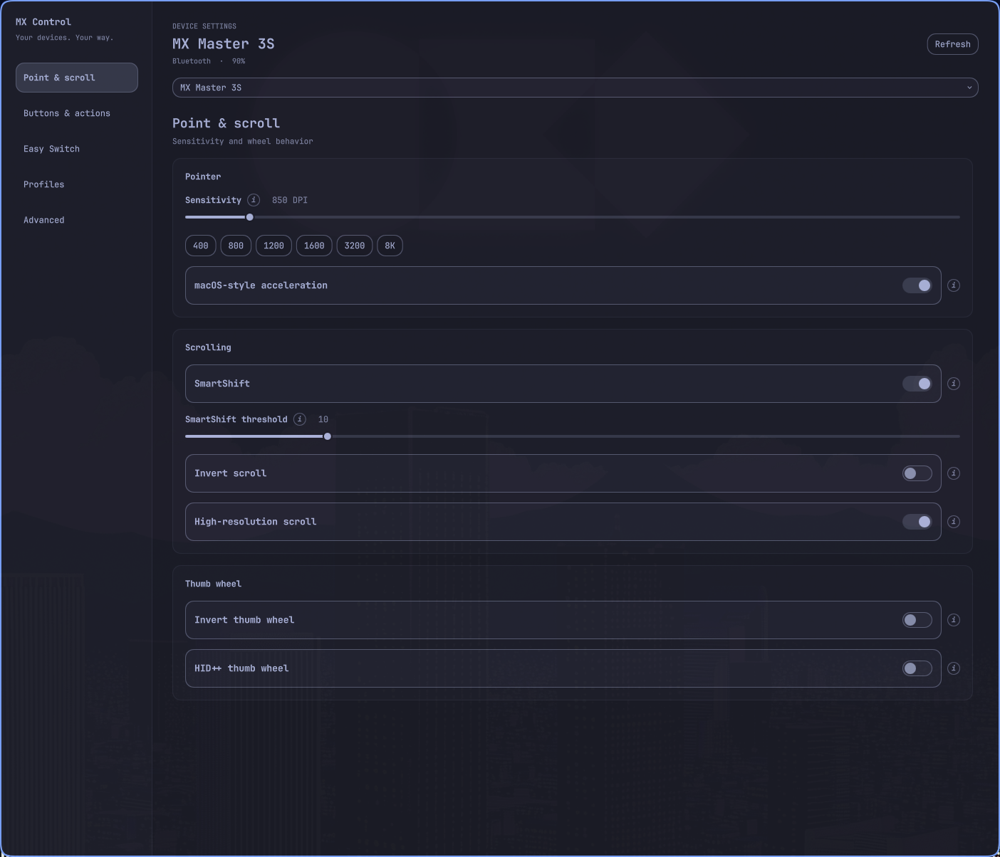
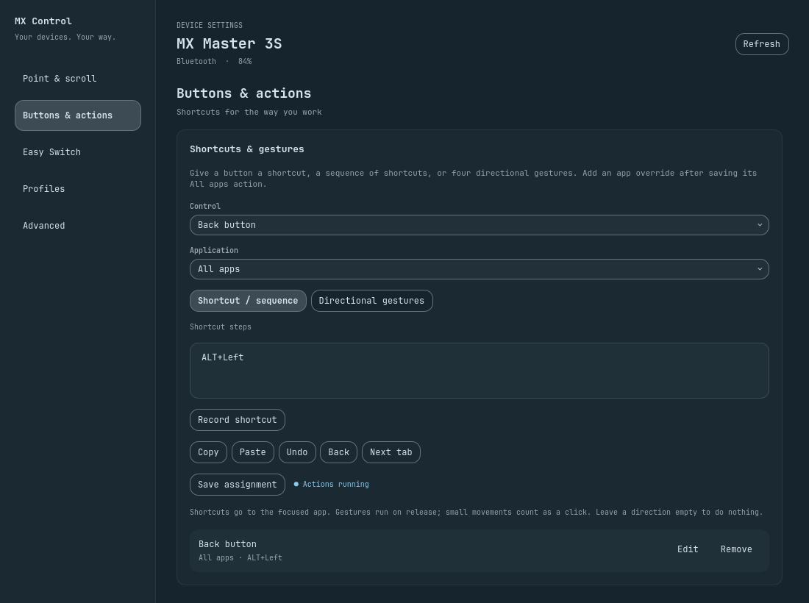

# MX Control

**Logitech device settings for the [Omarchy](https://omarchy.org/) bar — plus a full settings window.**

A Quattro plugin for Logitech MX mice and keyboards using Solaar’s HID++ support. Available controls depend on the model, firmware, and connection; receiver support does not guarantee support for every attached peripheral.

Inspired by Logi Options+, with partial hardware-settings coverage. Supported HID++ controls now have plugin-owned shortcuts, exact app-specific overrides, directional gestures, and short shortcut sequences on Omarchy’s Lua-based Hyprland. Flow, cloud backup, firmware management, and the full Smart Actions workflow are not implemented. Real-device validation of the new action runtime is still required. See the [feature parity review and roadmap](docs/options-parity-review.md).

It lives inside the long-running `omarchy-shell` process. It never starts a second Quickshell instance.

<p align="center">
  
</p>

## Install

Review the code first. Plugins run unsandboxed as your user.

```sh
omarchy plugin add https://github.com/zachwilke/omarchy-mxcontrol.git
```

That clones the repo into `~/.config/omarchy/plugins/io.github.zachwilke.mx/` and leaves it **disabled**. Read the files, then:

```sh
omarchy plugin enable io.github.zachwilke.mx
omarchy pkg add solaar
```

Or do both in one step after you have reviewed the source:

```sh
omarchy plugin add https://github.com/zachwilke/omarchy-mxcontrol.git --enable
omarchy pkg add solaar
```

Solaar is optional until you want to change settings. Without it the bar still lists connected MX devices. After installing Solaar, reconnect the device (or toggle its Bluetooth channel / unplug and replug the receiver) so the hidraw udev rules apply.

Move the widget if you want it somewhere else:

```sh
omarchy bar move io.github.zachwilke.mx --section right
```

`omarchy plugin add` only clones files and toggles enabled state. It does not run install hooks, does not use sudo, and does not overwrite your Hyprland or Solaar config.

## Remove

```sh
omarchy plugin disable io.github.zachwilke.mx
omarchy plugin remove io.github.zachwilke.mx
```

Removal deletes the plugin checkout and takes the widget out of the bar. On unload the helper stops and removes its command files and lock from the private runtime directory (`$XDG_RUNTIME_DIR/omarchy-mx/` or `/run/user/$UID/omarchy-mx/`). A `status.json` snapshot may remain as a warm-start cache; it lives on tmpfs and vanishes on reboot, and the UI treats it as stale until a live helper heartbeats it again.

Left in place on purpose:

| Path | Why it stays |
| --- | --- |
| `solaar` package | Shared system package; other tools may use it |
| `~/.config/solaar/` | Your saved device profiles |
| Device onboard settings | DPI, SmartShift, remaps live on the hardware |
| `~/.config/omarchy-mx/` | Local profiles and software action assignments |

Nothing in `~/.config/hypr/` or the rest of `~/.config/omarchy/` is rewritten except the bar layout entry that `omarchy plugin remove` already owns.

## Usage

| Input | Action |
| --- | --- |
| Left click | Open or close the bar popover |
| Right click | Re-read everything live from the device (bypasses the settings cache) |
| Hover **i** | Explain that setting |
| Escape | Close the popover or settings window |
| `j` / `k` | Move the popover cursor |
| Enter | Activate the focused control |
| `r` in the popover / Ctrl+R in settings | Refresh |
| **All settings** | Open the full settings window |

```sh
omarchy-shell shell summon io.github.zachwilke.mx '{}'
omarchy-shell shell hide io.github.zachwilke.mx
```

`summon` opens the **settings window** (remaps, divert/gestures, keyboard extras, profiles). The bar icon still opens the lean popover.

### Bar popover

- Battery and connection (Bluetooth, USB, Bolt, Unifying, Lightspeed)
- Sensitivity in 50 DPI steps, including **8K** (8000 DPI)
- SmartShift, invert scroll, high-resolution scroll
- Thumb-wheel invert
- Easy Switch hosts

### Settings window

A sidebar on wide windows and wrapping tabs on smaller windows separate device controls, button/key actions, Easy Switch, local profiles, and Advanced settings. The window follows the active Omarchy theme and lists only controls reported by the device.



- Hardware button/key remaps, shown as labeled controls
- Shortcuts and sequences of up to eight shortcuts, with a recorder and common presets
- App-specific overrides: select an open app or enter its exact Hyprland class
- Click plus up/down/left/right gestures on controls that expose raw XY reporting
- Optional external Solaar rule handling remains under **Hardware remaps & Solaar rules**
- Advanced scalar and keyed settings, including pointer speed and report rate when supported
- Rename Easy Switch channels (names are stored on the device and show on every computer)
- Keyboard Fn swap, backlight, platform, disable Caps/Win/Insert
- Local profiles on this computer (`~/.config/omarchy-mx/profiles.json`) — not Logi cloud, Easy Switch channel is not stored

### Software actions

Open **Buttons & actions** (or **Keys & actions**), choose a control, leave **Application** at **All apps**, and record a shortcut or select a preset. Save it to activate the action. You can then save overrides for individual apps. An All apps action is required so the control remains useful outside those apps; removing it also removes that control’s app overrides.

The recorder handles letters, numbers, F1–F12, and common navigation keys. Other key names, such as `XF86AudioPlay`, can be entered manually.

For sequences, enter one shortcut per line (up to eight), for example `CTRL+c` followed by `CTRL+Tab`. Steps are separated by 60 ms. They target the same window, and execution stops if focus changes. These are application shortcuts, not arbitrary shell commands or compositor bindings.

For gestures, select **Directional gestures** on a supported control. Configure its click action and any of the four directions. An empty direction does nothing. Actions fire on release; a short movement is treated as a click. Motion is captured while a gesture-enabled button is held, including when an app override uses a simple shortcut. Complex multi-segment gestures, configurable delays, and app-launch steps are not implemented.

Assignments live in `~/.config/omarchy-mx/actions.json`, separately from hardware profiles. The helper automatically resumes saved assignments when the plugin loads. It uses Solaar's library and its own notification read handles; the Solaar GUI does not need to run. Controls already diverted to Solaar are rejected: set their rule handling to **Regular** first, and do not run a separate Solaar rule for the same control.

The action runtime uses temporary diversion, verifies the device’s reported flags, and restores regular input when an assignment is removed or the helper exits normally. If the helper is forcibly killed or a device cannot acknowledge restoration, reconnect that device. After a device wakes or reconnects, a heartbeat checks/rearms its controls (up to 60 seconds). The UI reports listener/dispatch failures. Hardware testing across actual device models and transports remains necessary.


## Configure

Settings live on the bar layout entry in `~/.config/omarchy/shell.json`. The plugin does not keep a separate config file.

| Key | Default | Meaning |
| --- | --- | --- |
| `refreshIntervalSec` | `15` | How often to rescan hidraw when the helper is idle. Cheap sysfs only — it does not open HID++. |
| `selectedDevice` | `""` | Preferred device id; empty prefers the mouse |

## External dependencies

Nothing is installed automatically. `omarchy plugin add` only clones this repo.

### Required (already on Omarchy)

| Dependency | Package | Used for |
| --- | --- | --- |
| Omarchy 4 / Quattro | `omarchy` | Hosts the plugin inside `omarchy-shell` (Quickshell). No second Quickshell process. |
| Python 3 | `python` | Runs `mxctl.py`. Only the stdlib is imported unless Solaar is present. |
| bash | `bash` | Optional **Reload udev** command line only. |

### Optional

| Dependency | Package | License | Used for |
| --- | --- | --- | --- |
| [Solaar](https://github.com/pwr-Solaar/Solaar) | `solaar` (Arch extra) | GPL-2.0-or-later | HID++ read/write through `logitech_receiver` and `solaar.configuration`. Also ships the udev rules that make `/dev/hidraw*` user-accessible. |
| BlueZ | `bluez` | GPL-2.0-or-later | Battery overlay via `Quickshell.Bluetooth` when the HID++ helper is not open. |
| udev | `systemd` | LGPL-2.1-or-later | Only if you click **Reload udev**. |

Install Solaar yourself:

```sh
omarchy pkg add solaar
```

The panel’s **Install Solaar** button runs that same command in a terminal (`omarchy-launch-tui`). It does not install packages silently.

### Commands this plugin may start

| Command | When | Privilege |
| --- | --- | --- |
| `python3 mxctl.py discover` | Periodic hidraw scan | User |
| `python3 mxctl.py serve` | After you open the panel (keeps hidraw open) | User |
| `python3 mxctl.py write-cmd` | Panel setting changes (writes one `cmd-*.json` per change) | User |
| `python3 mxctl.py runtime-dir` | Creates the private runtime directory | User |
| `python3 mxctl.py cleanup` | Plugin unload / remove | User |
| `hyprctl -j clients` | Populate the application picker when settings opens | User |
| `hyprctl -j activewindow` | Resolve and verify an action’s target window | User |
| `hyprctl dispatch hl.dsp.send_shortcut(...)` | Run a user-configured shortcut | User |
| `omarchy-launch-tui omarchy pkg add solaar` | **Install Solaar** button | User; you confirm the package install |
| `omarchy-launch-tui sudo bash -lc 'udevadm control --reload-rules && udevadm trigger'` | **Reload udev** button | You type your password in a terminal. Never run automatically. |

No pip packages, no AUR-only packages, no remote downloads, no install hooks.

### Runtime files

`$XDG_RUNTIME_DIR/omarchy-mx/` when that variable is set, otherwise `/run/user/$UID/omarchy-mx/` (`status.json`, a `cmd-*.json` command spool, `mxctl.lock`). Each command is its own spool file so quick bursts of changes are never lost. Created mode `0700` as your user. Never `/tmp`. Command files and the lock are deleted by `mxctl.py cleanup` when the plugin unloads; leftover commands from a dead session are purged at the next start so they can never replay.

### Privileges

The helper talks to `/dev/hidraw*` as your user. Solaar’s udev rules grant that access after you install Solaar and reconnect the device. The plugin never writes `/etc`, never edits `~/.config/hypr/`, and never starts a second Quickshell process.

`~/.config/solaar/` is Solaar’s own store. This plugin may update it when you change a setting (through Solaar’s library). Removal does not delete that directory.

## Develop

Action tests use synthetic HID++ packets, mocked control flags, and mocked Hyprland calls. They never send keys to real applications or change connected hardware.

```sh
omarchy plugin validate .
python3 mxctl.py discover
python3 mxctl.py cleanup
python3 -m unittest discover -s test -v
node test/plain_hid_text.js
node test/settings_model.js
```

Battery: readings come from the kernel's `hidpp_battery_*` power-supply nodes first — the kernel keeps them current from device battery events, so they are fresh at zero HID++ radio cost and work for every connection type, even before the helper ever runs. While the helper is serving it re-checks them on every wake (≤30 s) and publishes on change; the HID++ radio read remains only as a slow fallback for devices the kernel does not cover. Bluetooth devices additionally get the BlueZ battery overlay as a last resort.

Idle cost: the bar path only scans sysfs (no Solaar import, no hidraw open). The manifest declares a `service` entry point, so the shell instantiates **one shared Service** for the whole plugin — every monitor's bar widget and the settings window drive the same helper, device selection, and snapshot. On shells without plugin services, each widget falls back to a local instance (passive except for one active owner). After you open the panel the helper blocks on inotify for spooled `cmd-*.json` files and hidraw plug events; a 60-second heartbeat re-reads only the battery and stamps the snapshot fresh. Initial reads stream: the helper publishes after every HID++ setting read, so the first controls paint while the rest of the burst is still running.

When software actions are configured, independent read handles listen for HID++ button/motion notifications. Assigned controls are checked on the existing heartbeat so they can recover after sleep. With no assignments, these listeners are not started.

Saved files under `~/.config/omarchy/plugins/io.github.zachwilke.mx/` reload automatically. If a change looks stale:

```sh
omarchy-shell shell rescanPlugins
omarchy restart shell
```

## License

[GPL-2.0-or-later](LICENSE). Copyright © 2026 Zach Wilke.

The Python helper imports Solaar’s `logitech_receiver` library, which is also GPL. See [Solaar](https://github.com/pwr-Solaar/Solaar).
